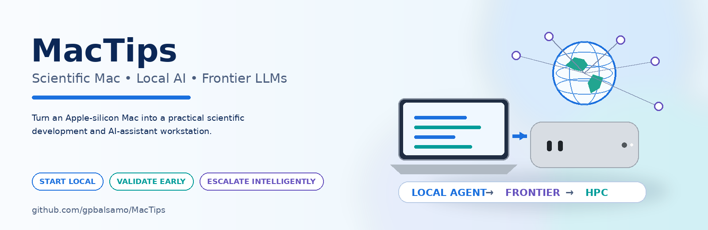

# MacTips

## 🍎Mac-silicon AI-assistant for Land-Climate research

A practical guide to configuring an Apple-silicon Mac for scientific software
development, local AI inference and AI-assisted Earth-system model development,
with [ecLand](https://github.com/ecmwf-ifs/ecland) as the worked example.

> How can a scientist turn a compact Mac into a useful scientific assistant,
> while keeping frontier AI and HPC for the tasks that genuinely need them?

```
START LOCAL.
VALIDATE EARLY.
ESCALATE INTELLIGENTLY.
SCALE ONLY WHEN JUSTIFIED.
```

Keep routine, bounded work **local**. Use **frontier models** (Claude, Codex)
for difficult reasoning. Use **ECMWF HPC** for production-scale computation.
A local LLM is not a replacement for any of these; it is a deliberately narrow
assistant. **The LLM chooses actions, tools perform them, validators decide
PASS/FAIL.**

```
Scientific Mac (Python, MPI, NetCDF, ecCodes, CDO, ecLand) + local LLM (Ollama / MLX)
                                    ↓
               Local AI agent → deterministic tools → validator
                       ↓                                  ↓
                PASS: next task              FAIL after 2 tries: Claude / Codex
                                                          ↓
                                         ECMWF HPC only when scale requires it
```

## Three levels of use

Each level is useful on its own.

| Level | You get | Guides |
|-------|---------|--------|
| **Scientific workstation** | A Mac that builds and runs scientific software | [01 setup](docs/01-mac-scientific-setup.md), [02 Python](docs/02-python-and-science-stack.md), [03 ecLand](docs/03-ecland-on-apple-silicon.md) |
| **Local AI workstation** | Local inference and frontier coding agents | [04 Ollama / MLX](docs/04-local-llm-with-ollama.md), [05 Claude & Codex](docs/05-frontier-agents-claude-codex.md) |
| **Scientific assistant** | A local agent driving validated tools, escalating when stuck | [06 architecture](docs/06-hybrid-scientific-assistant.md), [07 benchmark cascade](docs/07-ecland-benchmark-cascade.md), [08 specialisation](docs/08-frontier-assisted-specialisation.md) |

The ecLand ladder runs from cheap to expensive: build + `ctest` → one
[PLUMBER2](https://github.com/gpbalsamo/plumber2-ecland) site → LIAISE smoke test
([liaise-ecland](https://github.com/gpbalsamo/liaise-ecland)) → short global
[WFDE5](https://github.com/gpbalsamo/wfde5-ecland) test → CaMa-Flood → HPC. Build
steps come from [ecLand4U](https://github.com/gpbalsamo/ecLand4U).

Hardware examples (laptop, Mac mini node, and a Linux/WSL2 RTX node for CUDA
inference and small training) are in
[10 hardware profiles](docs/10-hardware-profiles.md); RTX node setup is in
[11](docs/11-rtx-linux-node.md). None replaces large-scale training or
production HPC.

## Safety

Agents that run commands can do damage, and frontier escalation can send
repository content off your machine. Read [AGENTS.md](AGENTS.md) (short contract
for a small local agent) and
[09 security](docs/09-security-and-safe-agent-use.md). After any change:
`git status`, `git diff`, `git diff --stat`.

## Quick start

The scripts are read-only and install nothing unless you ask.

```bash
git clone https://github.com/gpbalsamo/MacTips.git && cd MacTips
./scripts/bootstrap_mac.sh --check
./scripts/check_science_stack.sh
./scripts/check_ai_stack.sh
```

Then follow guides 01 → 04. Copy `config/*.example.yaml` to local, uncommitted
files for your own values.

## Historical documentation

The original macOS Catalina / MacPorts notes are preserved unchanged in
[docs/archive/macos-catalina-macports.md](docs/archive/macos-catalina-macports.md).
